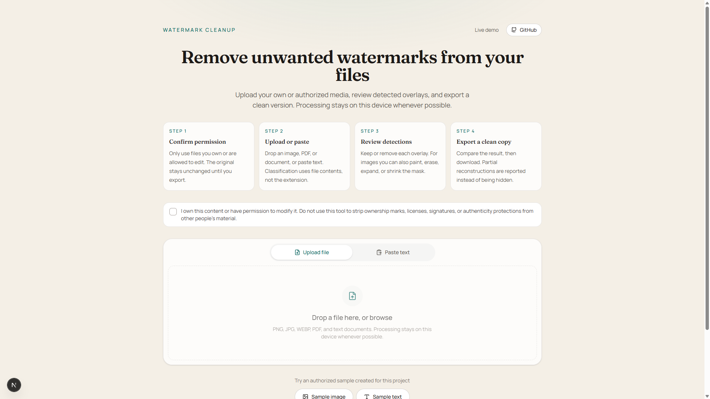

# Watermark Cleanup

[](https://github.com/MadanMohan0537/watermark-cleanup/actions/workflows/ci.yml)
[](LICENSE)


A privacy-first watermark and overlay cleanup tool for images, PDFs, and text documents. Upload content you own or are authorized to edit, inspect detected overlay candidates, choose exactly what should be removed, compare the result, and export a cleaned copy.

**Live demo:** https://watermark-cleanup.madanmohanlearning.workers.dev/



## Project highlights

- Privacy-first local/browser processing whenever possible.
- Human-in-the-loop review instead of automatic destructive removal.
- Image, PDF, TXT, Markdown, and browser-side WEBP support.
- Built-in sample image, sample text, and paste-text demo so reviewers can try the flow without a personal file.
- Magic-byte file classification instead of trusting extensions alone.
- Heuristic overlay detection with confidence-scored Keep / Remove review.
- Rectangle, brush, erase, expand, and shrink mask tools, with keyboard shortcuts `R`, `B`, and `E`.
- Before/after comparison for cleaned images.
- Text-aware PDF cleanup when supported.
- Side-by-side text diff before export.
- Cloudflare Workers deployment through OpenNext.
- Automated CI for tests, linting, type checking, and production builds.

## Why this project

Many cleanup tools behave like black boxes: users upload a file, the service edits it aggressively, and there is little visibility into what was detected or changed. This project takes a more controlled approach.

1. **Review before removal** — detections are suggestions, not automatic deletions.
2. **Least-destructive editing** — only confirmed regions are reconstructed or removed.
3. **Privacy by default** — the main processing path stays on the device whenever possible.
4. **Transparent output** — users can compare the original and processed result before downloading.

## How it works

```text
Upload, paste, or load a sample
             ↓
Validate and classify input
             ↓
Detect likely overlay regions
             ↓
Review, keep, remove, or edit masks
             ↓
Apply the least-destructive cleanup path
             ↓
Compare original and cleaned result
             ↓
Export the cleaned file
```

## Detection pipeline

### Images

The image detector scores overlay-like regions using signals such as:

- alpha/transparency
- corner and edge contrast
- luminance changes
- compact overlay geometry
- repeated/tiled visual patterns

### PDFs and text

PDF and text analysis looks for repeated, rotated, translucent, or overlay-like strings. The detector is intentionally conservative so normal body content is not silently removed.

## Cleanup pipeline

The processor chooses the least destructive available operation:

1. Reverse a uniform translucent overlay when the model fits.
2. Otherwise reconstruct only the selected image mask using local inpainting.
3. For PDFs, remove confirmed overlay text from page content when possible.
4. For text, generate a proposed cleaned version and show the diff before export.

## Supported formats

| Input | Current behavior |
| --- | --- |
| PNG | Detect, review, mask-edit, clean, export |
| JPG / JPEG | Detect, review, mask-edit, clean, export |
| WEBP | Browser-side cleanup |
| PDF | Review and clean supported overlays |
| TXT | Detect repeated overlay-like text and export cleaned text |
| Markdown | Detect repeated overlay-like text and export cleaned text |

Video can be classified by the processor registry, but video watermark cleanup is not implemented yet.

## Quick demo

1. Open the [live deployment](https://watermark-cleanup.madanmohanlearning.workers.dev/).
2. Click **Sample image** or **Sample text**, or confirm permission, choose **Paste text**, and click **Load demo**.
3. Review the detected overlay candidates.
4. Choose what to keep or remove. For images you can also paint or erase the mask.
5. Compare the result and export a cleaned copy.

This makes the project easy to evaluate without requiring a reviewer to find a sample file first.

## Tech stack

| Layer | Technology |
| --- | --- |
| Application | Next.js 16, React 19, TypeScript |
| Styling / UI | Tailwind CSS, Radix UI, Lucide React |
| Image processing | `fast-png`, `jpeg-js`, local pixel/mask pipeline |
| PDF processing | `pdf-lib`, `pdfjs-dist` |
| Validation | Zod |
| Testing | Vitest |
| CI | GitHub Actions |
| Deployment | Cloudflare Workers via `@opennextjs/cloudflare` |

## Project structure

```text
app/                  Next.js pages and API routes
components/
  comparison/         Before/after and diff views
  editor/             Region review and manual mask tools
  layout/             Site header and navigation
  results/            Export/download UI
  uploader/           Authorization and input flow
  workspace/          Main application workflow
lib/
  client/             Browser-side orchestration
  detection/          Overlay detection logic
  image-processing/   Image reconstruction and masks
  pdf-processing/     PDF analysis and cleanup
  processors/         Processor registry
  security/           Input/security helpers
  storage/            Temporary storage abstraction
  text-processing/    Text detection and cleanup
public/samples/       Authorized demo files used by the live app
fixtures/             Authorized test fixtures
docs/                 Architecture, usage, API, and deployment notes
scripts/              Fixture and public-asset generation
.github/              CI, issue templates, and pull request template
```

## Documentation

| Document | What it covers |
| --- | --- |
| [docs/usage.md](docs/usage.md) | End-user walkthrough |
| [docs/architecture.md](docs/architecture.md) | Detection and cleanup pipeline |
| [docs/api.md](docs/api.md) | Optional server API |
| [docs/deployment.md](docs/deployment.md) | Cloudflare Workers / OpenNext |
| [CONTRIBUTING.md](CONTRIBUTING.md) | How to propose changes |
| [SECURITY.md](SECURITY.md) | Vulnerability reporting |

## Privacy and responsible use

- Browser/local processing is the default path.
- Originals are not used for model training.
- The original file is never modified in place.
- Temporary server-side files, when used, are addressed through random IDs and expire after 30 minutes.
- Users must confirm ownership or permission before processing their own files.
- Built-in samples are project-owned fixtures created for this repository.

Use this project only for content you own or are authorized to modify. It is not intended to remove copyright notices, signatures, authenticity marks, licenses, or ownership identifiers from third-party material.

## Local development

### Requirements

- Node.js 20+
- npm

```bash
git clone https://github.com/MadanMohan0537/watermark-cleanup.git
cd watermark-cleanup
npm install
npm run generate:fixtures
npm run generate:assets
npm run dev
```

Open `http://localhost:3000`.

On the home screen you can upload a file after confirming permission, click **Sample image** / **Sample text**, or use **Paste text** → **Load demo**.

## Quality checks

```bash
npm test
npm run lint
npm run typecheck
npm run build
```

GitHub Actions runs these checks on pull requests and pushes to `master`. Authorized test files are stored under `fixtures/authorized`.

## Cloudflare Workers deployment

The application is configured for Cloudflare Workers using `@opennextjs/cloudflare`.

```bash
npx wrangler login
npm run deploy
```

For Git-connected Workers Builds:

| Setting | Value |
| --- | --- |
| Build command | `npm run build:cloudflare` |
| Deploy command | `npx opennextjs-cloudflare deploy` |
| Root directory | `/` |

A standard `npm run build` creates the Next.js `.next` output but does not produce the `.open-next` Worker artifact required for deployment.

See [docs/deployment.md](docs/deployment.md) for the full deployment notes.

## Current limitations

- Overlay detection is heuristic and can miss subtle or heavily blended marks.
- Complex photographic reconstruction can leave visible seams.
- Encrypted PDFs are rejected.
- Server-side WEBP decoding is not supported; the browser path should be used.
- OCR and OpenCV.js integrations are extension points rather than required dependencies.
- Video cleanup is not implemented yet.

## Viable next additions

The strongest future improvements would be:

- batch processing with per-file review
- OCR-assisted text-mask detection for scanned documents
- optional local-only mode indicator with clearer processing telemetry
- undo/redo for manual mask edits
- downloadable processing report describing detected and removed regions
- video-frame cleanup with temporal consistency

## Contributing

Contributions are welcome. See [CONTRIBUTING.md](CONTRIBUTING.md).

## Security

See [SECURITY.md](SECURITY.md) for security-reporting guidance.

## License

Licensed under the [MIT License](LICENSE).
